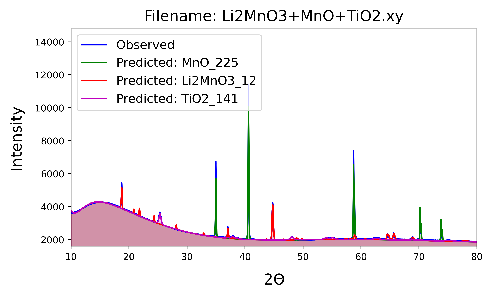

# An automatic analysis tool for XRD

A package designed to automate the process of phase identification from XRD spectra using a probabilistic deep learning trained with physics-informed data augmentation.

The corresponding manuscript can be found at [Chemistry of Materials](https://pubs.acs.org/doi/full/10.1021/acs.chemmater.1c01071). Reproducing the published results can be accomplished using the data provided in [figshare](https://figshare.com/s/69030545b8020de35633).

## Installation

First clone the repository:

```
git clone https://github.com/njszym/XRD-AutoAnalyzer.git
```

Then, to install all required modules, navigate to the cloned directory and execute:

```
pip install . --user
```

## Usage example

A pre-trained model for the Li-Mn-Ti-O-F chemical space is available in the ```Example/``` directory. To classify the experimentally measured patterns tabulated in the ```Spectra/``` sub-folder, run the following:

```
python run_CNN.py
```

The characterization of each spectrum should take around 1-2 minutes on a single processor. Once all classifications are made, the predicted phases will be printed along with their associated probabilities.

For a detailed walkthrough of the steps used to perform phase identification, please see https://github.com/njszym/XRD-AutoAnalyzer/blob/main/Tutorial/tutorial-notebook.ipynb.

## Training the model for new compositions

To develop a model that can be used to perform phase identification in a new chemical space, place all relevant CIFs into ```Novel_Space/All_CIFs```. Then navigate to the ```Novel_Space/```directory and execute:

```
python construct_model.py
```

This script will:

1) Filter all unique stoichiometric phases from the provided CIFs.

2) If ```--include_ns``` is specified: generate hypothetical solid solutions between the stoichiometric phases.

3) Simulate augmented XRD spectra from the phases produced by (1) and (2).

4) Train a convolutional neural network on the augmented spectra.

By default, training spectra will be simulated over 2θ spanning 10-80 degrees in Cu K-alpha radiation. However, this can be customized as follows:

```
python construct_model.py --min_angle=10.0 --max_angle=80.0
```

The model creation process may require a substantial amount of computational resources depending on the size of the composition space considered. For example: performing all necessary steps to create a model in the Li-Mn-Ti-O-F space, which included 255 reference phases, required about 12 hours of computational runtime on 16 cores. Required computational time should scale linearly with the number of reference phases. Similarily, time is reduced linearly with the number of cores used as all processes executed here are perfectly parallel (i.e., independent of one another).

When the procedure is completed, a trained ```Model.h5``` file will be made available. 

By default, the following bounds are used on artifacts included during data augmentation:

* Peak shifts: up to +/- 3% strain applied to each lattice parameter
* Peak broadening: domain size ranging from 5-50 nm
* Peak intensity variation: texture causing as much as +/- 50% change in peak height

However, custom bounds can also be specified, e.g., as follows:

```
python construct_model.py --max_strain=0.04 --min_domain_size=1 --max_domain_size=100 --max_texture=0.5
```

## Characterizing multi-phase spectra

In the directory containing ```Model.h5```, place all spectra to be classified in the ```Spectra/``` folder. These files should be in ```xy``` format.

Once all files are placed in the ```Spectra/``` folder, they can be classified by executing:

```
python run_CNN.py
```

Output will appear as:

```
Filename: (name of the spectrum)
Predicted phases: (phase_1 + phase_2 + ...)
Confidence: (probabilities associated with the phases above)
```

Phase labels are denoted as ```formula_spacegroup```.

By default, only phases with a confidence above 25% will be shown. To also show low-confidence phases, the ```-all``` argument can be used at runtime.

If spectra with a range of 2θ other than 10-80 degrees are considered, then the minimum and maximum diffraction angles (in Cu K-alpha) should be specified manually as shown below. Note: this range must match the range used during model creation (see section above).

```
python run_CNN.py --min_angle=10.0 --max_angle=80.0
```

The model assumes that spectra are measured using Cu K-alpha radiation. However, the user can specify any arbitary wavelength (```lambda```, in angstroms) as follows:

```
python run_CNN.py --wavelength=lambda
```

For each spectrum, the phase identification algorithm runs until either (i) a maximum of three unique compounds have been identified, or (ii) all peaks with intensities greater than or equal to 5% of the spectrum's maximum intensity have been identified. To change these parameters (denoted ```N``` and ```I```), the following arguments can be specified:

```
python run_CNN.py --max_phases=N --cutoff_intensity=I
```

To plot the line profiles of the predicted phases in the measured spectrum for comparison, the ```--plot``` option may also be used:

```
python run_CNN.py --plot
```

Which will yield a plot of the form:



If the user wishes to compare specific reference phases to the measured spectrum, the ```visualize.py``` script can be used as follows:

```
python visualize.py --ph='cmpd1_sg' --ph='cmpd2_sg'
```

Where ```cmpd1_sg``` and ```cmpd2_sg``` refer to the phases that will be fit to the spectrum and plotted. Note that minimum and maximum angles, as well as the wavelength, must also be specified if they differ from default values.
